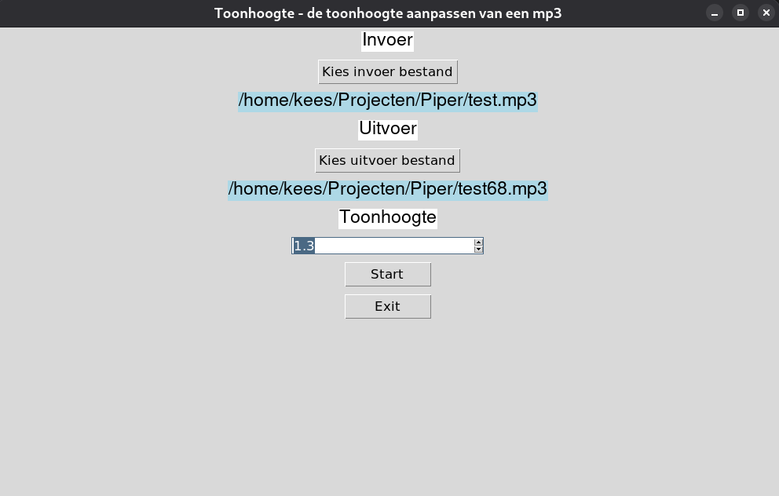

# Toonhoogte

Toonhoogte is gemaakt met Python en Tkinter. Toonhoogte paste de toonhoogte van een mp3 aan, zonder de duur van de mp3 aan te passen.

In het venster van Toonhoogte kun je het invoer betand selectren en een naam opgeven voor het uitvoerbestand. Kies een naam voor het uitvoerbestand die nog niet bestaat.

